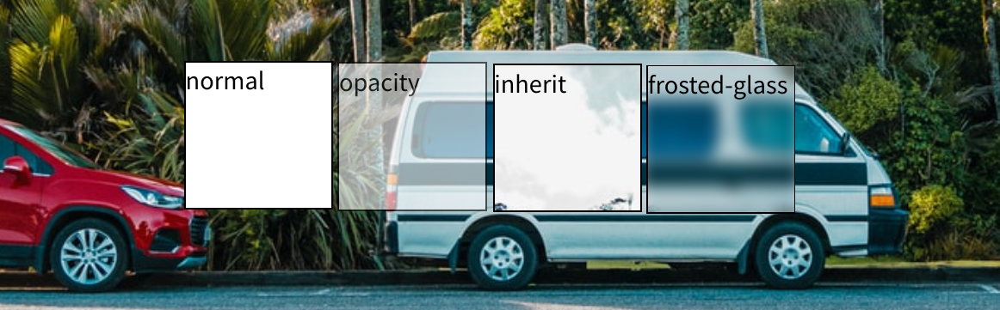

frosted-glass effect by CSS
===========================

[](https://macrat.github.io/css-frosted-glass-effect)

The frosted-glass effect implemented by CSS.

[demo](https://macrat.github.io/css-frosted-glass-effect)


## Keypoints

1. Copy background-image into a child element using 'inherit'.
2. Adjust the background image position using background-position.
3. Make blur by filter directive.

``` CSS
body {
    background-image: url("/path/to/image");
}

div {
    position: absolute;
    top: 10px;
    left: 20px;

    background-image: inherit;  // keypoint 1
    background-position: -10px -20px;  // keypoint 2
    filter: blur(5px);  // keypoint 3
}
```
